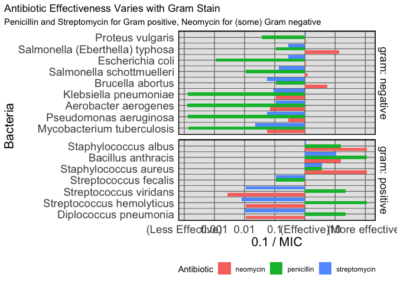
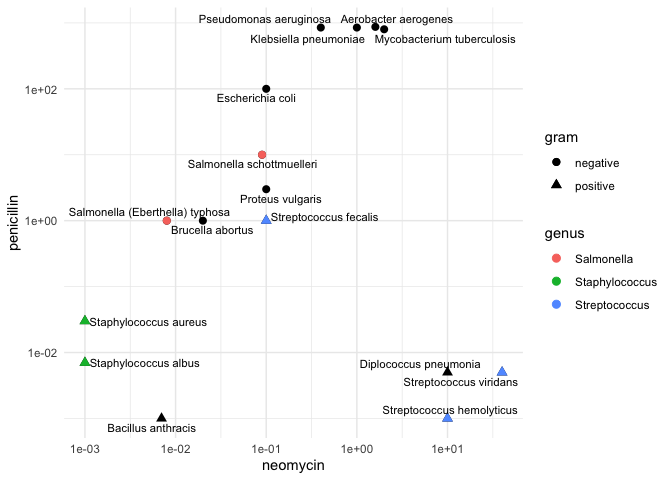

Antibiotics
================
Zach
2020-10-07

(Solution document)

*Purpose*: To create an effective visualization, we need to keep our
*purpose* firmly in mind. There are many different ways to visualize
data, and the only way we can judge efficacy is with respect to our
purpose.

In this challenge you’ll visualize the same data in two different ways,
aimed at two different purposes.

*Note*: Please complete your initial visual design **alone**. Work on
both of your graphs alone, and save a version to your repo *before*
coming together with your team. This way you can all bring a diversity
of ideas to the table\!

<!-- include-rubric -->

``` r
library(tidyverse)
```

    ## ── Attaching packages ─────────────────────────────────────────────────────────────────── tidyverse 1.3.0 ──

    ## ✓ ggplot2 3.3.2     ✓ purrr   0.3.4
    ## ✓ tibble  3.0.3     ✓ dplyr   1.0.2
    ## ✓ tidyr   1.1.2     ✓ stringr 1.4.0
    ## ✓ readr   1.3.1     ✓ forcats 0.5.0

    ## ── Conflicts ────────────────────────────────────────────────────────────────────── tidyverse_conflicts() ──
    ## x dplyr::filter() masks stats::filter()
    ## x dplyr::lag()    masks stats::lag()

``` r
library(ggrepel)
library(rzdr)
```

*Background*: The data\[1\] we study in this challenge report the
[*minimum inhibitory
concentration*](https://en.wikipedia.org/wiki/Minimum_inhibitory_concentration)
(MIC) of three drugs for different bacteria. The smaller the MIC for a
given drug and bacteria pair, the more practical the drug is for
treating that particular bacteria. An MIC value of *at most* 0.1 is
considered necessary for treating human patients.

These data report MIC values for three antibiotics—penicillin,
streptomycin, and neomycin—on 16 bacteria. Bacteria are categorized into
a genus based on a number of features, including their resistance to
antibiotics.

``` r
## NOTE: If you extracted all challenges to the same location,
## you shouldn't have to change this filename
filename <- "./data/antibiotics.csv"

## Load the data
df_antibiotics <- read_csv(filename)
```

    ## Parsed with column specification:
    ## cols(
    ##   bacteria = col_character(),
    ##   penicillin = col_double(),
    ##   streptomycin = col_double(),
    ##   neomycin = col_double(),
    ##   gram = col_character()
    ## )

``` r
df_antibiotics %>% knitr::kable()
```

| bacteria                        | penicillin | streptomycin | neomycin | gram     |
| :------------------------------ | ---------: | -----------: | -------: | :------- |
| Aerobacter aerogenes            |    870.000 |         1.00 |    1.600 | negative |
| Brucella abortus                |      1.000 |         2.00 |    0.020 | negative |
| Bacillus anthracis              |      0.001 |         0.01 |    0.007 | positive |
| Diplococcus pneumonia           |      0.005 |        11.00 |   10.000 | positive |
| Escherichia coli                |    100.000 |         0.40 |    0.100 | negative |
| Klebsiella pneumoniae           |    850.000 |         1.20 |    1.000 | negative |
| Mycobacterium tuberculosis      |    800.000 |         5.00 |    2.000 | negative |
| Proteus vulgaris                |      3.000 |         0.10 |    0.100 | negative |
| Pseudomonas aeruginosa          |    850.000 |         2.00 |    0.400 | negative |
| Salmonella (Eberthella) typhosa |      1.000 |         0.40 |    0.008 | negative |
| Salmonella schottmuelleri       |     10.000 |         0.80 |    0.090 | negative |
| Staphylococcus albus            |      0.007 |         0.10 |    0.001 | positive |
| Staphylococcus aureus           |      0.030 |         0.03 |    0.001 | positive |
| Streptococcus fecalis           |      1.000 |         1.00 |    0.100 | positive |
| Streptococcus hemolyticus       |      0.001 |        14.00 |   10.000 | positive |
| Streptococcus viridans          |      0.005 |        10.00 |   40.000 | positive |

# Visualization

<!-- -------------------------------------------------- -->

## Purpose: Compare Effectiveness

<!-- ------------------------- -->

**q1** Create a visualization of `df_antibiotics` that helps you to
compare the effectiveness of the three antibiotics across all the
bacteria reported. Make sure to show *all* of the bacteria, all three
antibiotic MIC values, and whether or not each bacterium is Gram
positive/negative. Can you make any broad statements about antibiotic
effectiveness?

``` r
## TASK: Create your visualization
df_antibiotics %>%
  pivot_longer(
    names_to = "antibiotic",
    values_to = "mic",
    cols = c(penicillin, streptomycin, neomycin)
  ) %>%
  mutate(
    inverse_mic = 0.11 / mic,
    fct_reorder(antibiotic, inverse_mic)
  ) %>%

  ggplot(
    aes(fct_reorder(bacteria, inverse_mic), inverse_mic, fill = antibiotic)
  ) +
  geom_col(position = "dodge") +
  geom_vline(xintercept = seq(1.5, 10, 1), size = 0.2) +

  scale_y_log10(
    breaks = c(1e-4, 1e-3, 1e-2, 1e-1, 1e+0, 1e+1, 1e+2),
    labels = c("(Less Effective)", 0.001, 0.01, 0.1, "(Effective)", 10, "(More effective)")
  ) +
  coord_flip() +
  scale_fill_discrete(name = "Antibiotic") +
  facet_grid(gram~., scales = "free", space = "free", labeller = label_both) +
  theme_minimal() +
  theme(
    legend.position = "bottom",
    plot.title.position = "plot",
    panel.border = element_rect(fill = NA, size = 1),
    panel.background = element_rect(fill = "grey90"),
    panel.grid.major = element_line(color = "grey50"),
    axis.text.x = element_text(size = 14),
    axis.title.x = element_text(size = 16),
    axis.text.y = element_text(size = 14),
    axis.title.y = element_text(size = 16),
    strip.text.y = element_text(size = 14)
  ) +
  labs(
    x = "Bacteria",
    y = "0.1 / MIC",
    title = "Antibiotic Effectiveness Varies with Gram Stain",
    subtitle = "Penicillin and Streptomycin for Gram positive, Neomycin for (some) Gram negative"
  )
```

<!-- -->

``` r
ggsave("./images/c05-antibiotics-all.png", width = 10, height = 6)
```

**Observations**:

  - Among the antibiotics considered here, only Neomycin is effective
    for Gram negative bacteria
  - Penicilin and Streptomycin tend to be more effective for Gram
    positive bacteria
  - None of the bacteria here are effective for a large collection of
    Gram negative bacteria

**Visual design notes**

  - The **purpose** of this graph is to compare all three antibiotic MIC
    values against a threshold. Therefore I pivoted the data in order to
    show all three MIC values on a single continuous axis.

  - I used `geom_col()` because bars help emphasize a “base” number. I
    plot the mutated value `0.1 / MIC` to put that “base” at MIC = 0.1.

  - I decided to use an axis to show the bacteria names, so I can show
    the Gram stain “for free” by using facets.

  - Since there are a lot of bacteria, I found it effective to map the
    MIC values to the horizontal axis, so that the bacteria names can
    remain horizontal without overlap.

  - This is a *highly subjective* point, but I find that “up” and
    “right” tend to correspond with “better” in visual language.
    Therefore my horizontal axis is actually *reversed*; I’m actually
    plotting `0.1 / MIC`. This effectively flips the axis to put more
    effective antibiotics towards the right of the plot.

  - I order the factors by median MIC value to add some structure.

  - I use manual `breaks` and `labels` in my `scale_` call to add some
    instructions on how to read this plot: note that the axis labels
    themselves tell the reader which direction is more or less
    effective.

  - I draw attention to primary takeaways in the title and subtitle of
    the graph.

## Purpose: Categorize Bacteria

<!-- ------------------------- -->

The *genus* of a living organism is a human categorization, based on
various characteristics of the organism. Since these categories are
based on numerous factors, we will tend to see clusters if we visualize
data according to relevant variables. We can use these visuals to
categorize observations, and to question whether given categories are
reasonable\!

**q2** Create a visualization of `df_antibiotics` that helps you to
categorize bacteria according to the variables in the data. Here your
emphasis **need not** be on whether MIC \< 0.1; instead focus on
detecting patterns between the individual bacteria.

Make sure to show *all* of the bacteria and whether or not each
bacterium is Gram positive/negative; you do *not* need to show all three
MIC values. Document your observations on how how clusters of bacteria
in the variables do—or don’t—align with their *genus* classification.

``` r
## TASK: Create your visualization
df_antibiotics %>%
  mutate(genus = str_extract(bacteria, "^\\w+")) %>%

  ggplot(aes(neomycin, penicillin)) +
  geom_point(
    aes(shape = gram),
    size = 2.5
  ) +
  geom_point(
    data = . %>%
      filter(genus %in% c("Streptococcus", "Staphylococcus", "Salmonella")),
    mapping = aes(color = genus, shape = gram),
    size = 2.5
  ) +
  geom_text_repel(
    aes(label = bacteria),
    size = 3
  ) +
  scale_x_log10() +
  scale_y_log10() +
  theme_minimal()
```

<!-- -->

``` r
ggsave("./images/c05-antibiotics-map.png")
```

    ## Saving 7 x 5 in image

**Observations**:

  - *Diplococcus pneumonia* is near two species of *Streptococcus*,
    which is odd.
  - *Streptococcus fecalis* is far from the other *Streptococcus*
    species, which is also odd.
  - In 1974 *Diplococcus pneumoniae* was renamed *Streptococcus
    pneumoniae*, and in 1984 *Streptococcus fecalis* was renamed
    *Enterococcus fecalis*.\[2\]

**Visual design notes**:

  - The **purpose** of this graph is to look for relationships between
    bacteria. This is easiest to do if the plot is constructed such that
    the observations lie close to each other if they are related.
    Therefore, I choose to leave the data unpivoted, and plot in a
    two-dimensional space of `penicillin` vs `neomycin`.
      - In contrast with the graph above (where the observations are
        arbitrarily distant from each other, based on ordering factors),
        in this q2 graph observations naturally lie close or far from
        each other, since they are represented with points.
  - I sub-select the genera for plotting, as it is far easier to
    distinguish between a smaller number of colors. Additionally there
    are many genera with only a single bacterium represented; those
    colors will essentially be wasted.
  - Shapes are even more difficult to distinguish than colors; I map
    `gram` to `shape` because there are only two levels, which makes
    this easy to distinguish.
  - I use a log-scale for both MIC values, as the values are very widely
    spread.

# References

<!-- -------------------------------------------------- -->

\[1\] Neomycin in skin infections: A new topical antibiotic with wide
antibacterial range and rarely sensitizing. Scope. 1951;3(5):4-7.

\[2\] Wainer and Lysen, “That’s Funny…” *American Scientist* (2009)
[link](https://www.americanscientist.org/article/thats-funny)
