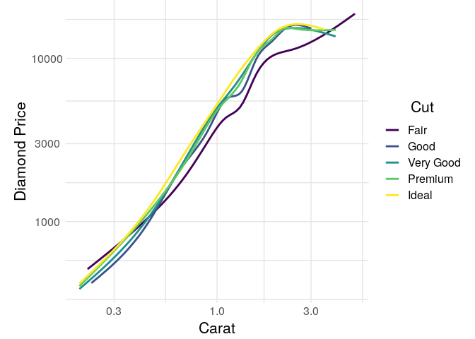
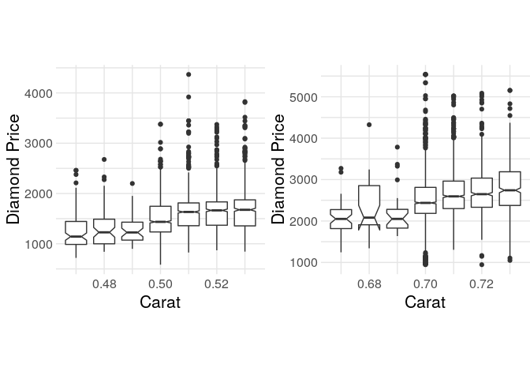

Diamonds Report
================
Zachary del Rosario
2020-09-16

An example analysis of the `diamonds`
    dataset.

``` r
library(tidyverse)
```

    ## ── Attaching packages ─────────────────────────────────────── tidyverse 1.3.0 ──

    ## ✔ ggplot2 3.3.1     ✔ purrr   0.3.4
    ## ✔ tibble  3.0.1     ✔ dplyr   1.0.0
    ## ✔ tidyr   1.1.0     ✔ stringr 1.4.0
    ## ✔ readr   1.3.1     ✔ forcats 0.5.0

    ## ── Conflicts ────────────────────────────────────────── tidyverse_conflicts() ──
    ## ✖ dplyr::filter() masks stats::filter()
    ## ✖ dplyr::lag()    masks stats::lag()

``` r
library(rzdr) # My custom library; https://github.com/zdelrosario/rzdr
library(cowplot)
```

    ## 
    ## ********************************************************

    ## Note: As of version 1.0.0, cowplot does not change the

    ##   default ggplot2 theme anymore. To recover the previous

    ##   behavior, execute:
    ##   theme_set(theme_cowplot())

    ## ********************************************************

# First Look

<!-- -------------------------------------------------- -->

You should **always** do your first checks when studying a dataset\!

``` r
diamonds %>% glimpse()
```

    ## Rows: 53,940
    ## Columns: 10
    ## $ carat   <dbl> 0.23, 0.21, 0.23, 0.29, 0.31, 0.24, 0.24, 0.26, 0.22, 0.23, 0…
    ## $ cut     <ord> Ideal, Premium, Good, Premium, Good, Very Good, Very Good, Ve…
    ## $ color   <ord> E, E, E, I, J, J, I, H, E, H, J, J, F, J, E, E, I, J, J, J, I…
    ## $ clarity <ord> SI2, SI1, VS1, VS2, SI2, VVS2, VVS1, SI1, VS2, VS1, SI1, VS1,…
    ## $ depth   <dbl> 61.5, 59.8, 56.9, 62.4, 63.3, 62.8, 62.3, 61.9, 65.1, 59.4, 6…
    ## $ table   <dbl> 55, 61, 65, 58, 58, 57, 57, 55, 61, 61, 55, 56, 61, 54, 62, 5…
    ## $ price   <int> 326, 326, 327, 334, 335, 336, 336, 337, 337, 338, 339, 340, 3…
    ## $ x       <dbl> 3.95, 3.89, 4.05, 4.20, 4.34, 3.94, 3.95, 4.07, 3.87, 4.00, 4…
    ## $ y       <dbl> 3.98, 3.84, 4.07, 4.23, 4.35, 3.96, 3.98, 4.11, 3.78, 4.05, 4…
    ## $ z       <dbl> 2.43, 2.31, 2.31, 2.63, 2.75, 2.48, 2.47, 2.53, 2.49, 2.39, 2…

We have observations on `carat, cut, color, clarity, price`; these are
the variables I focus
    on.

``` r
diamonds %>% summary()
```

    ##      carat               cut        color        clarity          depth      
    ##  Min.   :0.2000   Fair     : 1610   D: 6775   SI1    :13065   Min.   :43.00  
    ##  1st Qu.:0.4000   Good     : 4906   E: 9797   VS2    :12258   1st Qu.:61.00  
    ##  Median :0.7000   Very Good:12082   F: 9542   SI2    : 9194   Median :61.80  
    ##  Mean   :0.7979   Premium  :13791   G:11292   VS1    : 8171   Mean   :61.75  
    ##  3rd Qu.:1.0400   Ideal    :21551   H: 8304   VVS2   : 5066   3rd Qu.:62.50  
    ##  Max.   :5.0100                     I: 5422   VVS1   : 3655   Max.   :79.00  
    ##                                     J: 2808   (Other): 2531                  
    ##      table           price             x                y         
    ##  Min.   :43.00   Min.   :  326   Min.   : 0.000   Min.   : 0.000  
    ##  1st Qu.:56.00   1st Qu.:  950   1st Qu.: 4.710   1st Qu.: 4.720  
    ##  Median :57.00   Median : 2401   Median : 5.700   Median : 5.710  
    ##  Mean   :57.46   Mean   : 3933   Mean   : 5.731   Mean   : 5.735  
    ##  3rd Qu.:59.00   3rd Qu.: 5324   3rd Qu.: 6.540   3rd Qu.: 6.540  
    ##  Max.   :95.00   Max.   :18823   Max.   :10.740   Max.   :58.900  
    ##                                                                   
    ##        z         
    ##  Min.   : 0.000  
    ##  1st Qu.: 2.910  
    ##  Median : 3.530  
    ##  Mean   : 3.539  
    ##  3rd Qu.: 4.040  
    ##  Max.   :31.800  
    ## 

`summary` gives us a sense of variation across the entire dataset, but
only in a univariate way.

# Carat seems most important

<!-- -------------------------------------------------- -->

Here’s my figure that intimates that carat is the most important
variable for determining price.

``` r
diamonds %>%

  ggplot(aes(carat, price, color = cut)) +
  geom_smooth(se = FALSE) +

  scale_x_log10() +
  scale_y_log10() +
  viridis::scale_color_viridis(name = "Cut", discrete = TRUE) +
  theme_common() +
  labs(
    x = "Carat",
    y = "Diamond Price"
  )
```

    ## `geom_smooth()` using method = 'gam' and formula 'y ~ s(x, bs = "cs")'

<!-- -->

Note that this is *not* conclusive by itself; other variables could
account (conceivable) co-vary with carat and equally-explain the price.
The regression analysis below controls for other variables.

# Focus on pricing discontinuities

<!-- ------------------------- -->

The following are closer looks at the price-carat relationship, using
boxplots.

``` r
p1.disco <-
  diamonds %>%
  filter(
    0.47 <= carat,
    carat <= 0.53
  ) %>%

  ggplot(aes(carat, price)) +
  geom_boxplot(aes(group = carat), notch = TRUE) +

  theme_common() +
  labs(
    x = "Carat",
    y = "Diamond Price"
  )

p2.disco <-
  diamonds %>%
  filter(
    0.67 <= carat,
    carat <= 0.73
  ) %>%

  ggplot(aes(carat, price)) +
  geom_boxplot(aes(group = carat), notch = TRUE) +

  theme_common() +
  labs(
    x = "Carat",
    y = "Diamond Price"
  )

plot_grid(
  p1.disco,
  p2.disco,
  nrow = 1,
  ncol = 2
)
```

    ## notch went outside hinges. Try setting notch=FALSE.

<!-- -->

Looking at these, I see the price jump around `carat == 0.5` and `carat
== 0.7` as indicative of pricing anomalies. Essentially: People are
willing to pay a lot more for diamonds that are at or above these
“special” values.

# Model

<!-- -------------------------------------------------- -->

Fit model near “focal point” of `carat == 0.5` based on Scott and
Yelowitz (2012).

``` r
fit_c0.5 <-
  diamonds %>%
  filter(
    0.4 <= carat,
    carat <= 0.6
  ) %>%
  mutate(bump = carat >= 0.5) %>%

  lm(
    data = .,
    formula = log(price) ~ carat + cut + color + clarity + bump
  )

summary(fit_c0.5)
```

    ## 
    ## Call:
    ## lm(formula = log(price) ~ carat + cut + color + clarity + bump, 
    ##     data = .)
    ## 
    ## Residuals:
    ##      Min       1Q   Median       3Q      Max 
    ## -0.40626 -0.06837 -0.00665  0.05443  0.90031 
    ## 
    ## Coefficients:
    ##              Estimate Std. Error  t value Pr(>|t|)    
    ## (Intercept)  5.659994   0.016260  348.083  < 2e-16 ***
    ## carat        2.570858   0.038361   67.017  < 2e-16 ***
    ## cut.L        0.097632   0.005143   18.983  < 2e-16 ***
    ## cut.Q       -0.011948   0.004496   -2.657 0.007890 ** 
    ## cut.C       -0.019872   0.003589   -5.536 3.16e-08 ***
    ## cut^4       -0.015962   0.002698   -5.915 3.41e-09 ***
    ## color.L     -0.416268   0.004161 -100.049  < 2e-16 ***
    ## color.Q     -0.070268   0.003867  -18.171  < 2e-16 ***
    ## color.C     -0.003073   0.003644   -0.843 0.399135    
    ## color^4      0.024361   0.003271    7.447 1.03e-13 ***
    ## color^5      0.008610   0.003056    2.818 0.004844 ** 
    ## color^6      0.009688   0.002568    3.772 0.000162 ***
    ## clarity.L    0.864333   0.009580   90.223  < 2e-16 ***
    ## clarity.Q   -0.165216   0.009392  -17.590  < 2e-16 ***
    ## clarity.C    0.066381   0.007708    8.612  < 2e-16 ***
    ## clarity^4   -0.028790   0.005562   -5.176 2.31e-07 ***
    ## clarity^5    0.010648   0.003798    2.803 0.005069 ** 
    ## clarity^6    0.003591   0.002804    1.281 0.200207    
    ## clarity^7    0.017736   0.002352    7.541 5.03e-14 ***
    ## bumpTRUE     0.246516   0.004909   50.220  < 2e-16 ***
    ## ---
    ## Signif. codes:  0 '***' 0.001 '**' 0.01 '*' 0.05 '.' 0.1 ' ' 1
    ## 
    ## Residual standard error: 0.1058 on 11336 degrees of freedom
    ## Multiple R-squared:  0.9096, Adjusted R-squared:  0.9094 
    ## F-statistic:  6003 on 19 and 11336 DF,  p-value: < 2.2e-16

These model results tell me a number of things:

  - The regression coefficient on `carat` is *large*, indicating that
    this is a very important variable even when accounting for `cut,
    color, clarity` in the regression
      - This is called *controlling* for other factors (here `cut,
        color, clarity`)
  - The `bump` variable is also *large*; this model term represents the
    “price bump” that occurs simply by having a carat at or above the
    target focal point of `carat == 0.5`. This is the “discontinuous”
    part of the regression.
      - This `bump` idea is related to the notion of a [regression
        discontinuity](https://en.wikipedia.org/wiki/Regression_discontinuity_design),
        which we *will not* cover in this course
