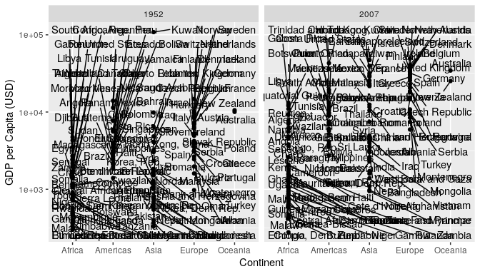

Visual Tricks with Gapminder
================
Zach del Rosario
2020-07-25

*Purpose*: This is an illustration of visual tricks related to
`c04-gapminder`.

``` r
library(tidyverse)
```

    ## ── Attaching packages ─────────────────────────────────────── tidyverse 1.3.0 ──

    ## ✔ ggplot2 3.3.1     ✔ purrr   0.3.4
    ## ✔ tibble  3.0.1     ✔ dplyr   1.0.0
    ## ✔ tidyr   1.1.0     ✔ stringr 1.4.0
    ## ✔ readr   1.3.1     ✔ forcats 0.5.0

    ## ── Conflicts ────────────────────────────────────────── tidyverse_conflicts() ──
    ## ✖ dplyr::filter() masks stats::filter()
    ## ✖ dplyr::lag()    masks stats::lag()

``` r
library(gapminder)
library(ggrepel)

## Setup related to the challenge
year_max <-
  gapminder %>%
  pull(year) %>%
  max()
year_min <-
  gapminder %>%
  pull(year) %>%
  min()
```

# Role of Scale Transforms

<!-- -------------------------------------------------- -->

Compare the following two graphs

``` r
set.seed(101)

gapminder %>%
  filter(year == year_min) %>%

  ggplot(aes(fct_reorder(continent, gdpPercap), gdpPercap)) +
  geom_point(position = position_jitter(height = 0, width = 0.1)) +
  labs(
    x = "Continent",
    y = "GDP per Capita (USD)",
    caption = str_c("in ", year_min),
    title = "Scale: Natural"
  )
```

<!-- -->

On a natural scale (non-transformed), the outlier in Asia drastically
stretches our scale, making it difficult to see variation among the
other countries.

``` r
set.seed(101)

gapminder %>%
  filter(year == year_min) %>%

  ggplot(aes(fct_reorder(continent, gdpPercap), gdpPercap)) +
  geom_point(position = position_jitter(height = 0, width = 0.1)) +
  scale_y_log10() +
  labs(
    x = "Continent",
    y = "GDP per Capita (USD)",
    caption = str_c("in ", year_min),
    title = "Scale: Log10"
  )
```

<!-- -->

On a log-scale our visual range is compressed, making it easier to
distinguish the individual countries.

``` r
gapminder %>%
  ggplot(aes(log10(gdpPercap))) +
  geom_histogram()
```

    ## `stat_bin()` using `bins = 30`. Pick better value with `binwidth`.

<!-- -->

``` r
gapminder %>%
  ggplot(aes(lifeExp)) +
  geom_histogram()
```

    ## `stat_bin()` using `bins = 30`. Pick better value with `binwidth`.

<!-- -->

``` r
gapminder %>%
  ggplot(aes(lifeExp, gdpPercap)) +
  geom_point()  +
  scale_y_log10()
```

<!-- -->

**Remember that scales are a “knob” you should turn**

# Ordering of factors

<!-- -------------------------------------------------- -->

## MPG dataset

<!-- ------------------------- -->

*Ordering* our factor levels is very important when there are many
levels:

Imagine trying to (quickly) tell which manufacturer has the generally
most-efficient vehicles in the dataset:

``` r
mpg %>%

  ggplot(aes(manufacturer, cty)) +
  geom_boxplot() +
  coord_flip()
```

<!-- -->

Try answering the same question with the following figure.

``` r
mpg %>%
  mutate(manufacturer = fct_reorder(manufacturer, cty)) %>%

  ggplot(aes(manufacturer, cty)) +
  geom_boxplot() +
  coord_flip()
```

<!-- -->

All that’s changed between the two is the ordering of the *factor
levels*. Generally alphabetical order is meaningless.

## Gapminder Dataset

<!-- ------------------------- -->

Ordering factors still useful with the gapminder set.

``` r
gapminder %>%
  filter(year %in% c(year_max, year_min)) %>%

  ggplot(aes(continent, gdpPercap)) +
  geom_boxplot() +
  geom_point(
    data = . %>% filter(country %in% c("Kuwait", "United States", "Canada")),
    mapping = aes(color = country)
  ) +
  scale_y_log10() +
  scale_color_discrete(name = "Outliers") +
  facet_grid(~year) +
  labs(
    x = "Continent",
    y = "GDP per Capita (USD)"
  )
```

<!-- -->

Ordering the factors makes the graph easier to parse.

``` r
gapminder %>%
  filter(year %in% c(year_max, year_min)) %>%

  ggplot(aes(fct_reorder(continent, gdpPercap), gdpPercap)) +
  geom_boxplot() +
  geom_point(
    data = . %>% filter(country %in% c("Kuwait", "United States", "Canada")),
    mapping = aes(color = country)
  ) +
  scale_y_log10() +
  scale_color_discrete(name = "Outliers") +
  facet_grid(~year) +
  labs(
    x = "Continent",
    y = "GDP per Capita (USD)"
  )
```

<!-- -->

**If your factors do not have a meaningful order, use another variable
to give them a meaningful order.**

# Use of Layers

<!-- -------------------------------------------------- -->

Trying to color-label all countries is a mess:

``` r
gapminder %>%
  filter(year %in% c(year_max, year_min)) %>%

  ggplot(aes(continent, gdpPercap)) +
  geom_point(
    mapping = aes(color = country)
  ) +
  scale_y_log10() +
  scale_color_discrete(name = "Outliers") +
  facet_grid(~year) +
  labs(
    x = "Continent",
    y = "GDP per Capita (USD)"
  )
```

<!-- -->

We can do a *little* better by using text labels:

``` r
gapminder %>%
  filter(year %in% c(year_max, year_min)) %>%

  ggplot(aes(continent, gdpPercap)) +
  geom_point() +
  geom_text_repel(
    aes(label = country)
  ) +
  scale_y_log10() +
  scale_color_discrete(name = "Outliers") +
  facet_grid(~year) +
  labs(
    x = "Continent",
    y = "GDP per Capita (USD)"
  )
```

<!-- -->

At least we can see something\! Filtering at the *top* level removes a
lot of the context we’re seeking:

``` r
gapminder %>%
  filter(year %in% c(year_max, year_min)) %>%
  group_by(year) %>%
  filter(dense_rank(desc(gdpPercap)) <= 5) %>%

  ggplot(aes(continent, gdpPercap)) +
  geom_point() +
  geom_text_repel(
    aes(label = country)
  ) +
  scale_y_log10() +
  scale_color_discrete(name = "Outliers") +
  facet_grid(~year) +
  labs(
    x = "Continent",
    y = "GDP per Capita (USD)"
  )
```

<!-- -->

We would do better to use the *layers* functionality of ggplot; filter
out the data *within a specific layer* to emphasize points:

``` r
gapminder %>%
  filter(year %in% c(year_max, year_min)) %>%

  ggplot(aes(fct_reorder(continent, gdpPercap), gdpPercap)) +
  ## Boxplot gets all of the data
  geom_boxplot() +
  geom_point(
    ## NOTE: The filter *inside* one of the layers
    data = . %>% filter(country %in% c("Kuwait", "United States", "Canada")),
    mapping = aes(color = country)
  ) +
  scale_y_log10() +
  scale_color_discrete(name = "Outliers") +
  facet_grid(~year) +
  labs(
    x = "Continent",
    y = "GDP per Capita (USD)"
  )
```

<!-- -->

**Use ggplot’s layers to highlight important observations.**

# Permuting variables

<!-- -------------------------------------------------- -->

*Small changes* to our aesthetic assignments can have a large impact on
readability. For instance: The following two visuals are virtually
identical *except* that I’ve swapped two of the aesthetics: `continent`
and `year`.

Compare version 1:

``` r
gapminder %>%
  filter(year %in% c(year_max, year_min)) %>%

  ggplot(aes(fct_reorder(continent, gdpPercap), gdpPercap)) +
  geom_boxplot() +
  geom_point(
    ## NOTE: The filter *inside* one of the layers
    data = . %>% filter(country %in% c("Kuwait", "United States", "Canada")),
    mapping = aes(color = country)
  ) +
  scale_y_log10() +
  scale_color_discrete(name = "Outliers") +
  facet_grid(~year) +
  labs(
    x = "Continent",
    y = "GDP per Capita (USD)"
  )
```

<!-- -->

Note that version 1 makes comparisons *within* a year *between*
continents easy.

Compare with version 2:

``` r
gapminder %>%
  filter(year %in% c(year_max, year_min)) %>%

  ggplot(aes(fct_reorder(as.factor(year), gdpPercap), gdpPercap)) +
  geom_boxplot() +
  geom_point(
    ## NOTE: The filter *inside* one of the layers
    data = . %>% filter(country %in% c("Kuwait", "United States", "Canada")),
    mapping = aes(color = country)
  ) +
  scale_y_log10() +
  scale_color_discrete(name = "Outliers") +
  facet_grid(~continent) +
  labs(
    x = "Year",
    y = "GDP per Capita (USD)"
  )
```

<!-- -->

Note that the second one makes comparisons *within* a continent
*between* years easy.

Which version is “correct” *depends on the question you are trying to
answer*.

**Design your visuals based on the comparison you are trying to make.**

“… the heart of quantitative thinking: “Compared to what?”" - Edward
Tufte
