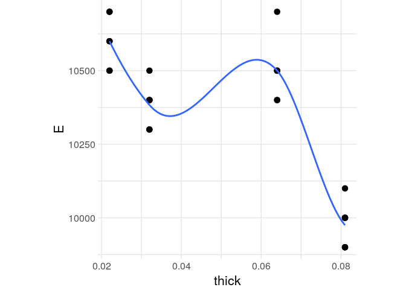
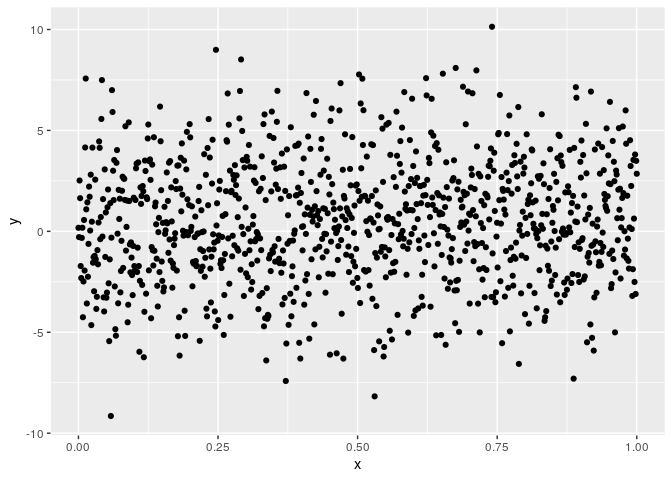
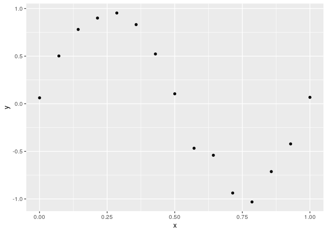

Judging Trends Under Noise
================
Zach
2020-09-30

This short notebook is about judging trends when those trends are
corrupted by
    noise.

``` r
library(tidyverse)
```

    ## ── Attaching packages ─────────────────────────────────────── tidyverse 1.3.0 ──

    ## ✔ ggplot2 3.3.1     ✔ purrr   0.3.4
    ## ✔ tibble  3.0.1     ✔ dplyr   1.0.0
    ## ✔ tidyr   1.1.0     ✔ stringr 1.4.0
    ## ✔ readr   1.3.1     ✔ forcats 0.5.0

    ## ── Conflicts ────────────────────────────────────────── tidyverse_conflicts() ──
    ## ✖ dplyr::filter() masks stats::filter()
    ## ✖ dplyr::lag()    masks stats::lag()

``` r
filename <- "./data/stang.csv"
df_stang <- read_csv(filename)
```

    ## Parsed with column specification:
    ## cols(
    ##   thick = col_double(),
    ##   E_00 = col_double(),
    ##   nu_00 = col_double(),
    ##   E_45 = col_double(),
    ##   nu_45 = col_double(),
    ##   E_90 = col_double(),
    ##   nu_90 = col_double(),
    ##   alloy = col_character()
    ## )

``` r
df_stang_long <-
  df_stang %>%
  pivot_longer(
    names_to = c(".value", "angle"),
    names_sep = "_",
    cols = c(-thick, -alloy)
  ) %>%
  mutate(angle = as.integer(angle)) %>%
  filter(E >= 0, nu >= 0)
```

## \#\# Little data, a dubious trend

First, let’s look at the elasticity against sample thickness:

``` r
df_stang_long %>%

  ggplot(aes(thick, E)) +
  geom_point(size = 3) +
  geom_smooth(se = FALSE) +
  rzdr::theme_common()
```

    ## `geom_smooth()` using method = 'loess' and formula 'y ~ x'

    ## Warning in simpleLoess(y, x, w, span, degree = degree, parametric =
    ## parametric, : pseudoinverse used at 0.081295

    ## Warning in simpleLoess(y, x, w, span, degree = degree, parametric =
    ## parametric, : neighborhood radius 0.049295

    ## Warning in simpleLoess(y, x, w, span, degree = degree, parametric =
    ## parametric, : reciprocal condition number 2.9951e-17

    ## Warning in simpleLoess(y, x, w, span, degree = degree, parametric =
    ## parametric, : There are other near singularities as well. 0.001024

<!-- -->

**Observations**:

  - There is a general negative trend between `E` and `thick`
  - However, note that this trend isn’t *monotone*; it doesn’t go *only
    down*, it goes down-up-down
      - For variables like elasticity and thickness, it’s *dubious* that
        we would see a non-monotone trend like this. Therefore, I think
        this pattern is probably spurious.

## \#\# Lots of data, lots of noise

Next, let’s look at a case where we have *tons* of data:

``` r
n <- 1e3
tibble(x = seq(0, 1, length.out = n)) %>%
  mutate(y = x + rnorm(sd = 3, n = n)) %>%

  ggplot(aes(x, y)) +
  geom_point()
```

<!-- -->

**Observations**:

  - Since I generated the data, *I know* there’s a trend underlying the
    data.
  - However, since there’s *a ton* of noise, even having `1000` data
    points doesn’t make things clearer.

## \#\# Little data, little noise

One last example:

``` r
n <- 15
tibble(x = seq(0, 1, length.out = n)) %>%
  mutate(y = sin(2 * pi * x) + rnorm(sd = 0.1, n = n)) %>%

  ggplot(aes(x, y)) +
  geom_point()
```

<!-- -->

**Observations**:

  - Since I generated the data, *I know* there’s a trend underlying the
    data.
  - Here we have just 15 observations (with Stang we had 26), but the
    trend is fairly clear.

## \# Punchline

“More data” is **not** always the right answer. It depends on:

  - The strength of the underlying **signal** (or **trend**)
  - The degree of **noise** lying on top of that signal
