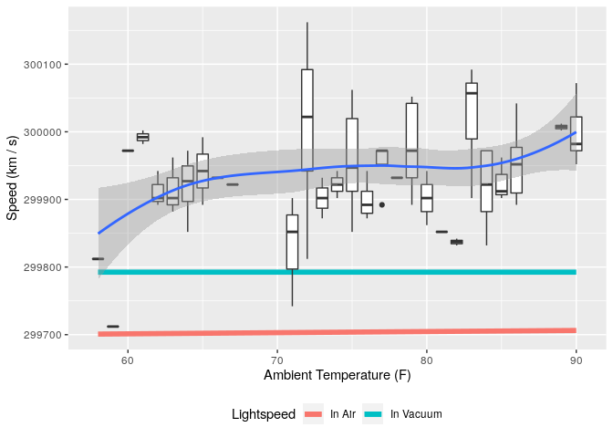

Michelson Data: Speed of Light in Air
================
Zach
2020-09-28

The purpose of this notebook is to approximate the real effects of
temperature on the speed-of-light in air, due to changes in the index of
refraction.

``` r
# Libraries
library(tidyverse)
library(googlesheets4)

url <- "https://docs.google.com/spreadsheets/d/1av_SXn4j0-4Rk0mQFik3LLr-uf0YdA06i3ugE6n-Zdo/edit?usp=sharing"

# Parameters
LIGHTSPEED_VACUUM    <- 299792.458 # Exact speed of light in a vacuum (km / s)
LIGHTSPEED_MICHELSON <- 299944.00  # Michelson's speed estimate (km / s)
LIGHTSPEED_PM        <- 51         # Michelson error estimate (km / s)

## Note: No need to edit this chunk!
gs4_deauth()
ss <- gs4_get(url)
df_michelson <-
  read_sheet(ss) %>%
  select(Date, Distinctness, Temp, Velocity) %>%
  mutate(Distinctness = as_factor(Distinctness))

df_q2 <-
  df_michelson %>%
  mutate(VelocityVacuum = Velocity + 92)
```

Estimate the effect of temperature-varying refraction on lightspeed.

``` r
df_q2 %>%
  mutate(
    T_K = (Temp - 32) * 5/9 + 273.15, # Convert to Kelvin
    n = 1 + 0.000293 * 300 / T_K, # Index of refraction for air
    c_air = LIGHTSPEED_VACUUM / n # Lightspeed in air
  ) %>%

  ggplot(aes(Temp, VelocityVacuum)) +
  geom_line(
    aes(y = LIGHTSPEED_VACUUM, color = "In Vacuum"),
    size = 2
  ) +
  geom_line(
    aes(y = c_air, color = "In Air"),
    size = 2
  ) +
  geom_boxplot(aes(group = Temp)) +
  geom_smooth() +

  scale_color_discrete(name = "Lightspeed") +
  theme(legend.position = "bottom") +
  labs(
    x = "Ambient Temperature (F)",
    y = "Speed (km / s)"
  )
```

    ## `geom_smooth()` using method = 'loess' and formula 'y ~ x'

<!-- -->

**Observations**:

  - The predicted variation in lightspeed in a medium due to
    temperature-dependent index of refraction for air is *much much
    smaller* than the observed variation in measured speed-of-light
    values.
      - Therefore, temperature does not adequately explain the variation
        we see with temperature.
