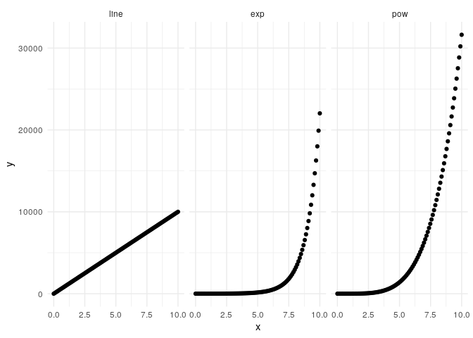
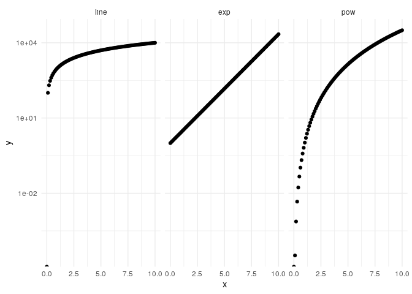
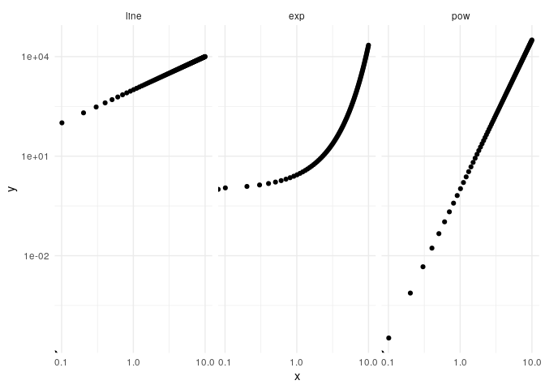

Challenges of visual comparison
================
Zach
2020-09-22

This notebook illustrates how difficult it is to differentiate between a
power law

\[y = x^a\]

and an exponential

\[y = \exp(x)\]

through visual comparison
    alone.

``` r
library(tidyverse)
```

    ## ── Attaching packages ─────────────────────────────────────── tidyverse 1.3.0 ──

    ## ✔ ggplot2 3.3.1     ✔ purrr   0.3.4
    ## ✔ tibble  3.0.1     ✔ dplyr   1.0.0
    ## ✔ tidyr   1.1.0     ✔ stringr 1.4.0
    ## ✔ readr   1.3.1     ✔ forcats 0.5.0

    ## ── Conflicts ────────────────────────────────────────── tidyverse_conflicts() ──
    ## ✖ dplyr::filter() masks stats::filter()
    ## ✖ dplyr::lag()    masks stats::lag()

Generate data from an exponential and a power law.

``` r
df_data <-
tibble(x = seq(0, 10, length.out = 100)) %>%
  mutate(
    y_line = 1000 * x,
    y_exp = exp(x),
    y_pow = x ^ 4.5
  ) %>%
  pivot_longer(
    names_to = c(".value", "fun"),
    names_sep = "_",
    cols = c(y_line, y_exp, y_pow)
  ) %>%
  mutate(fun = fct_relevel(fun, "line", "exp", "pow"))
```

## Natural scale

<!-- ------------------------- -->

Can you visually distinguish between the two nonlinear functions?

``` r
df_data %>%
  ggplot(aes(x, y)) +
  geom_point() +

  facet_wrap(~fun) +
  theme_minimal()
```

<!-- -->

## Semilog scale

<!-- ------------------------- -->

A semilog scale can help us see an exponential trend.

``` r
df_data %>%
  ggplot(aes(x, y)) +
  geom_point() +

  scale_y_log10() +
  facet_wrap(~fun) +
  theme_minimal()
```

    ## Warning: Transformation introduced infinite values in continuous y-axis

<!-- -->

## Loglog scale

<!-- ------------------------- -->

A loglog scale can help us see a power law trend.

``` r
df_data %>%
  ggplot(aes(x, y)) +
  geom_point() +

  scale_x_log10() +
  scale_y_log10() +
  facet_wrap(~fun) +
  theme_minimal()
```

    ## Warning: Transformation introduced infinite values in continuous x-axis

    ## Warning: Transformation introduced infinite values in continuous y-axis

<!-- -->
