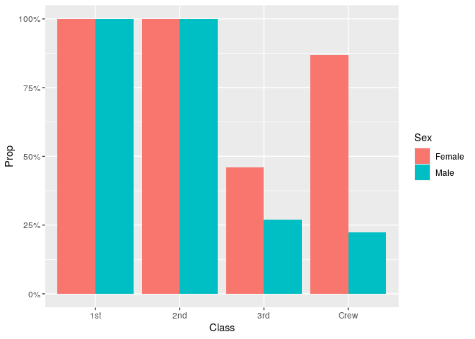
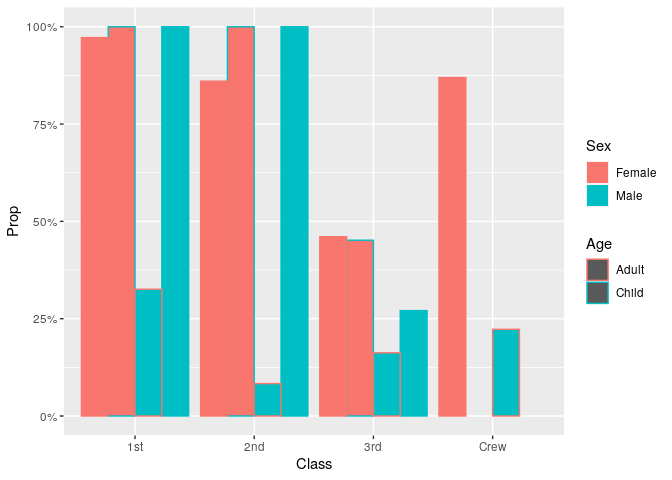

RMS Titanic: Fishy Plots
================
Zach
2020-09-24

``` r
library(tidyverse)
```

    ## ── Attaching packages ─────────────────────────────────────── tidyverse 1.3.0 ──

    ## ✔ ggplot2 3.3.1     ✔ purrr   0.3.4
    ## ✔ tibble  3.0.1     ✔ dplyr   1.0.0
    ## ✔ tidyr   1.1.0     ✔ stringr 1.4.0
    ## ✔ readr   1.3.1     ✔ forcats 0.5.0

    ## ── Conflicts ────────────────────────────────────────── tidyverse_conflicts() ──
    ## ✖ dplyr::filter() masks stats::filter()
    ## ✖ dplyr::lag()    masks stats::lag()

``` r
df_titanic <- as_tibble(Titanic)
```

# Fishy Bar Charts

<!-- -------------------------------------------------- -->

Let’s compute the proportions, as in the challenge

``` r
## NOTE: No need to edit! We'll cover how to
## do this calculation in a later exercise.
df_prop <-
  df_titanic %>%
  group_by(Class, Sex, Age) %>%
  mutate(
    Total = sum(n),
    Prop = n / Total
  ) %>%
  ungroup()

df_prop
```

    ## # A tibble: 32 x 7
    ##    Class Sex    Age   Survived     n Total    Prop
    ##    <chr> <chr>  <chr> <chr>    <dbl> <dbl>   <dbl>
    ##  1 1st   Male   Child No           0     5   0    
    ##  2 2nd   Male   Child No           0    11   0    
    ##  3 3rd   Male   Child No          35    48   0.729
    ##  4 Crew  Male   Child No           0     0 NaN    
    ##  5 1st   Female Child No           0     1   0    
    ##  6 2nd   Female Child No           0    13   0    
    ##  7 3rd   Female Child No          17    31   0.548
    ##  8 Crew  Female Child No           0     0 NaN    
    ##  9 1st   Male   Adult No         118   175   0.674
    ## 10 2nd   Male   Adult No         154   168   0.917
    ## # … with 22 more rows

If we try to plot this with only aesthetics for `Sex, Class`, we get the
following:

``` r
df_prop %>%
  filter(Survived == "Yes") %>%

  ggplot(aes(Class, Prop, fill = Sex)) +
  geom_col(position = "dodge") +

  scale_y_continuous(labels = scales::label_percent())
```

    ## Warning: Removed 2 rows containing missing values (geom_col).

<!-- -->

Note that this *falsely* implies that everyone in the 1st and 2nd
classes survived\! Adding an aesthetic for `Age` helps reveal what went
wrong:

``` r
df_prop %>%
  filter(Survived == "Yes") %>%

  ggplot(aes(Class, Prop, fill = Sex, color = Age)) +
  geom_col(position = "dodge") +

  scale_y_continuous(labels = scales::label_percent())
```

    ## Warning: Removed 2 rows containing missing values (geom_col).

<!-- -->

Ggplot essentially hid some of the bars, which contributed to a false
impression of the data. It turns out to not be a huge deal for the
Female passengers (Adults and Children had not-too-dissimilar survival
rates), but for Males this is *extremely misleading*.

**Punchline**: Know thine data\! If there are variables you’re not
plotting, make sure you’re at least **aware** of the fact that you’re
not plotting them\!
